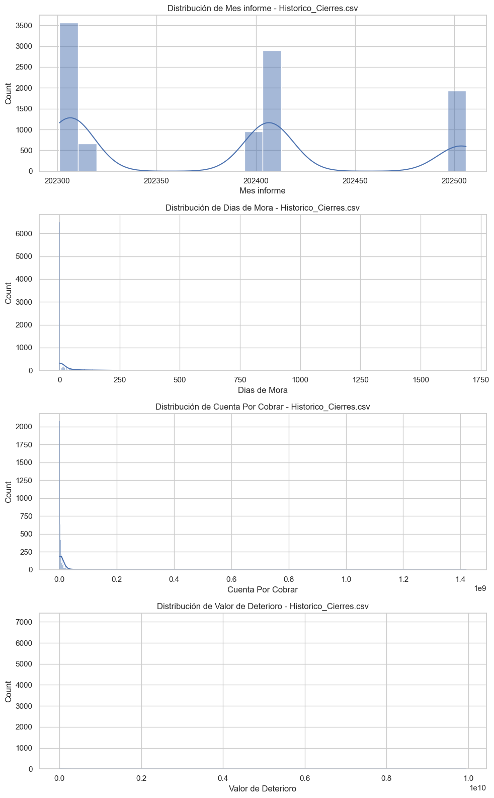
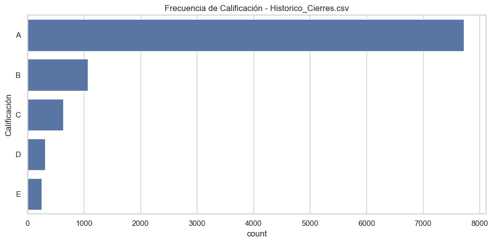
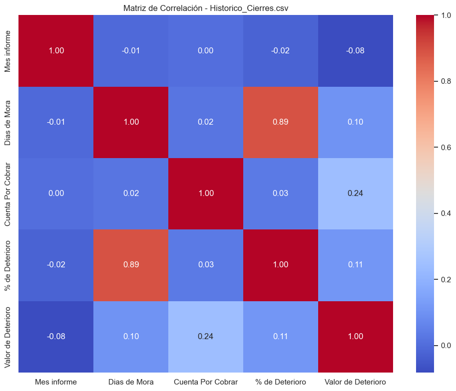

# Reporte de Análisis CRISP-DM: Modelos de Deterioro NIIF 9

## Etapa 1: Comprensión del Negocio

### Contexto del Negocio
Basado en los archivos analizados, el negocio corresponde a una entidad financiera o de crédito que gestiona una cartera de clientes corporativos o individuales. El objetivo principal parece ser el **cálculo y gestión del deterioro de cartera bajo la norma NIIF 9** (Instrumentos Financieros), la cual exige reconocer pérdidas crediticias esperadas.

Los datos cubren:
- **Comportamiento histórico de pagos** (`Historico_Cierres`, `Historico_Facturas`).
- **Información financiera de los clientes** (`Informacion_Clientes`).
- **Entorno macroeconómico** (`Variables_Macro`), crucial para modelos *forward-looking* exigidos por NIIF 9.

### Objetivos de Análisis
1.  **Estimar la Pérdida Esperada (ECL):** Desarrollar modelos que permitan calcular el deterioro de cartera basándose en la probabilidad de incumplimiento (PD), pérdida dado el incumplimiento (LGD) y exposición al incumplimiento (EAD).
2.  **Segmentación de Riesgo:** Identificar perfiles de riesgo de clientes utilizando indicadores financieros (liquidez, endeudamiento) y comportamiento de pago histórico para optimizar las estrategias de cobranza y originación.
3.  **Análisis de Impacto Macroeconómico:** Determinar cómo las variables macroeconómicas (IPC, PIB, Tasas) correlacionan con el deterioro de la cartera para incorporar escenarios prospectivos en el cálculo de provisiones.

### Preguntas Clave
1.  ¿Existe una correlación fuerte entre los indicadores financieros del cliente (ej. `ENDEUDAMIENTO`, `LIQUIDEZ_CORRIENTE`) y su clasificación de riesgo (`Calificación`) o días de mora?
2.  ¿Cómo afecta la antigüedad de la factura (`Dias de Mora`) a la probabilidad de recuperación (`Valor_pagado` vs `Saldo`)?
3.  ¿Qué variables macroeconómicas muestran mayor sensibilidad frente a los cambios en el porcentaje de deterioro de la cartera?

---

## Etapa 2: Comprensión de los Datos

### 2.1 Resumen de Datasets

Se han cargado y analizado 5 datasets principales. A continuación, el resumen de calidad:

| Dataset | Filas | Columnas | Nulos Totales | Duplicados | Estado |
| :--- | :--- | :--- | :--- | :--- | :--- |
| **Historico_Cierres.csv** | 13,117 | 11 | 37 | 0 | ✅ Bueno |
| **Historico_Cierres_Tipo.csv** | 13,079 | 10 | 0 | 0 | ✅ Excelente |
| **Historico_Facturas.csv** | 61,393 | 9 | 1,590 | 0 | ⚠️ Revisar Pagos |
| **Informacion_Clientes.csv** | 2,697 | 24 | 511 | 0 | ⚠️ Nulos en Vars Fin. |
| **Variables_Macro.csv** | 906 | 9 | 2,234 | 0 | ⚠️ Series Incompletas |

### 2.2 Hallazgos y Calidad de Datos

#### **1. Historico_Cierres.csv**
- **Contenido:** Información mensual del estado de crédito por cliente.
- **Calidad:** Muy buena. Solo 37 nulos en `NIT` (0.28%), lo cual es despreciable pero debe limpiarse.
- **Variables Clave:** `Dias de Mora`, `Calificación`, `% de Deterioro`.
- **Observación:** La variable `Calificación` es categórica (A, B, C, D, E) y fundamental para la transición de estados de riesgo.

**Visualizaciones:**
A continuación se presentan gráficos descriptivos para este dataset principal:

*Distribución de Variables Numéricas:*

*Frecuencia de Variables Categóricas:*

*Matriz de Correlación:*

#### **2. Historico_Cierres_Tipo.csv**
- **Contenido:** Desglose similar al anterior pero incluye `nombre_linea` (ej. Inmobiliario, Administración).
- **Calidad:** Excelente, sin valores nulos ni duplicados.
- **Observación:** Permite análisis granular por tipo de producto.

#### **3. Historico_Facturas.csv**
- **Contenido:** Detalle transaccional de facturas.
- **Calidad:** Los nulos en `Valor_pagado` y `Fecha_pago` (1.29%) son esperados para facturas vigentes o no pagadas, no necesariamente un error.
- **Observación:** `Estado` (PAGADA, CONFIRMADA) es útil para calcular tasas de recuperación (LGD).

#### **4. Informacion_Clientes.csv**
- **Contenido:** Estados financieros (Activos, Pasivos, Ganancias).
- **Calidad:** Nulos en variables de variación (`VAR_...`) y `PASIVOS_NO_CORRIENTES`. Esto puede deberse a divisiones por cero o falta de reporte en periodos anteriores.
- **Observación:** Variables como `ROA`, `ENDEUDAMIENTO` y `LIQUIDEZ_CORRIENTE` están pre-calculadas, lo que facilita el modelado.

#### **5. Variables_Macro.csv**
- **Contenido:** Series de tiempo económicas.
- **Calidad:** Alta cantidad de nulos en valores absolutos (`smmlv`, `ipc`, `pib`). Sin embargo, las variables de variación porcentual (`var_pct_...`) están completas, lo cual es preferible para modelos de regresión.
- **Observación:** Series largas (desde 1950 en algunos casos), útiles para ver ciclos económicos.

### 2.3 Relaciones entre Datasets (Modelo de Datos)

Se identificaron las siguientes llaves para cruzar información:

1.  **Cliente <-> Cartera:**
    *   Campo: `NIT`
    *   Relación: `Informacion_Clientes` (Maestro) -> `Historico_Cierres` / `Historico_Facturas` (Transaccional).

2.  **Cartera <-> Macroeconomía:**
    *   Campo: `Fecha` (`Mes informe` en Cierres vs `fecha_cierre` en Macro).
    *   Uso: Asignar condiciones económicas a cada corte de cartera.

### 2.4 Recomendaciones

1.  **Limpieza:**
    *   Eliminar o imputar los 37 registros sin NIT en `Historico_Cierres`.
    *   Para `Informacion_Clientes`, imputar nulos en variaciones con 0 o la media del sector, según corresponda.
2.  **Ingeniería de Características:**
    *   Crear variables de "Vintage" (cosecha) usando `Fecha_expedicion` de facturas.
    *   Calcular el "Roll-rate" (tasa de deterioro) mensual de clientes pasando de calificación A a B, etc.
3.  **Modelado:**
    *   Priorizar el uso de `Historico_Cierres_Tipo` para modelos más específicos por línea de negocio.
    *   Usar las variaciones porcentuales de `Variables_Macro` en lugar de los valores absolutos para evitar problemas de estacionariedad.
